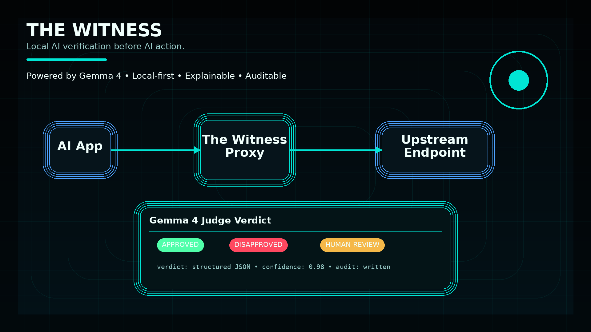
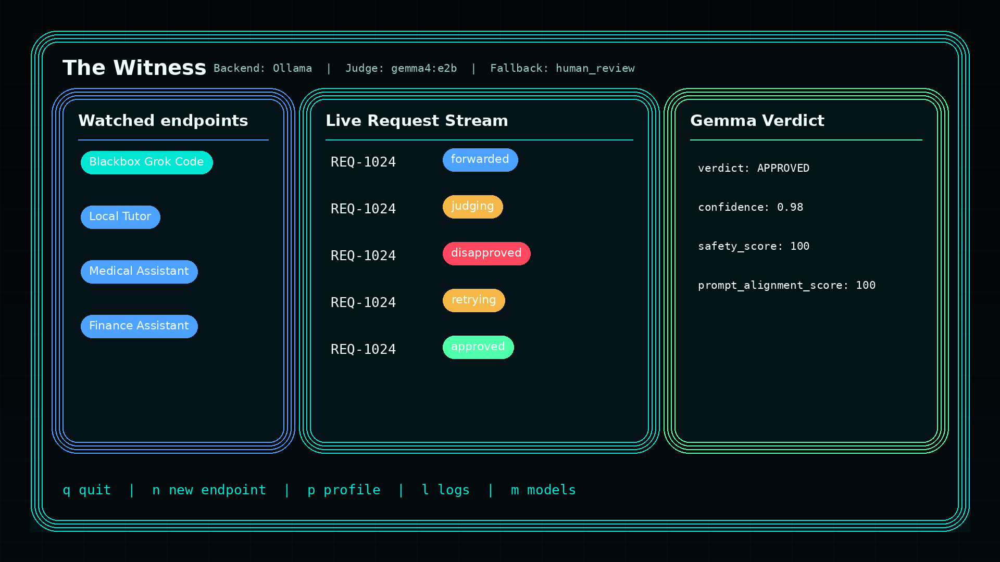
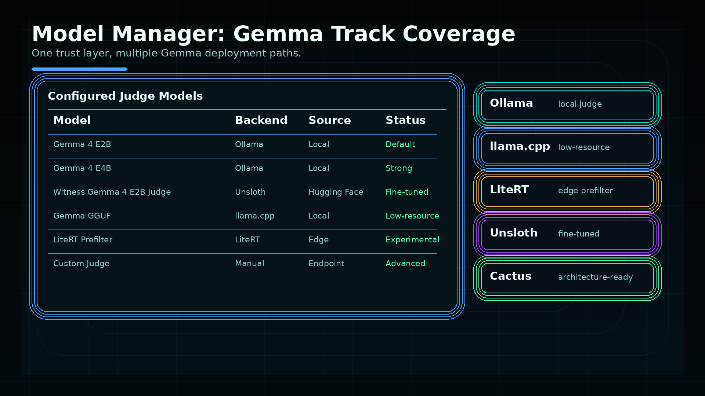

# The Witness
#Note : Gemma is a trademark of Google LLC.
The Witness is a local-first Gemma 4 reliability firewall for AI endpoints.

It runs as a modern TUI and OpenAI-compatible local proxy. Your app sends requests to The Witness, The Witness forwards them to the upstream AI endpoint, captures the candidate response, asks a local Gemma 4 judge for a strict JSON verdict, and only returns approved responses. Disapproved responses are blocked, repaired, retried, and logged. High-risk or uncertain responses can be paused for human review.

Security rule: never commit, print, screenshot, or log API keys or Kaggle tokens. Use environment variables such as `BLACKBOX_API_KEY`; examples reference `$BLACKBOX_API_KEY` only.

## Gallery







More Kaggle, README, social, logo, and launch assets are in [`gallery/README.md`](gallery/README.md).

## Quick install

```bash
curl -fsSL https://raw.githubusercontent.com/PLASMA-FR/the-witness/main/scripts/install.sh | bash
```

Safer inspect-first install:

```bash
curl -fsSL https://raw.githubusercontent.com/PLASMA-FR/the-witness/main/scripts/install.sh -o install.sh
less install.sh
bash install.sh
```

## Manual install

```bash
git clone https://github.com/PLASMA-FR/the-witness.git
cd the-witness
cargo build --release
./target/release/the-witness setup
./target/release/the-witness doctor
./target/release/the-witness start
```

Installer/default model policy:

```bash
WITNESS_DEFAULT_BACKEND="ollama"
WITNESS_DEFAULT_MODEL="gemma4:e2b"
WITNESS_STRONG_MODEL="gemma4:e4b"
WITNESS_FALLBACK="human_review"
```

## Default models

Default local judge:

```bash
ollama pull gemma4:e2b
```

Stronger/high-risk local judge:

```bash
ollama pull gemma4:e4b
```

Then test:

```bash
the-witness model test --backend ollama --model gemma4:e2b
```


## Web Dashboard

The Witness now includes a full local Web UI mission-control dashboard in addition to the TUI.

```bash
the-witness dashboard
```

Then open:

```text
http://127.0.0.1:8790
```

Run without opening a browser:

```bash
the-witness dashboard --no-open
the-witness dashboard --host 127.0.0.1 --port 8790
```

The dashboard exposes a localhost-only control API by default:

```text
GET  /api/health
GET  /api/config
PUT  /api/config
GET  /api/models
POST /api/models/download
POST /api/models/test
GET  /api/endpoints
POST /api/endpoints
PUT  /api/endpoints/:id
DELETE /api/endpoints/:id
POST /api/endpoints/:id/test
POST /api/endpoints/add-blackbox
GET  /api/requests
GET  /api/requests/:id
POST /api/requests/:id/replay
POST /api/requests/:id/approve
POST /api/requests/:id/reject
POST /api/requests/:id/regenerate
GET  /api/logs
GET  /api/audit/:id
GET  /api/system/doctor
POST /api/system/start-proxy
POST /api/system/stop-proxy
```

Security notes:

- The control API binds to `127.0.0.1` by default.
- If you bind it to a non-localhost address, The Witness prints a warning.
- API responses redact auth headers and static secret values.
- Prefer auth types `bearer_env` and `header_env`; do not put raw secrets in Git.

Web UI pages:

- Dashboard with request/approval/latency charts and live activity feed.
- Endpoint Manager with add/edit/delete/test/copy URL/copy curl and Blackbox one-click setup.
- Live Requests table with filters/search and detail navigation.
- Request Detail with prompt, candidate/final response, verdict JSON, retry chain, and actions.
- Prompt Repair workspace.
- Human Review Queue.
- Model Manager for Ollama Gemma 4 E2B/E4B, HF/Unsloth, llama.cpp, LiteRT, and manual endpoints.
- Logs/Audit viewer.
- Doctor/System Health.
- Settings and service information.

## Windows Quick Install

PowerShell one-liner:

```powershell
powershell -ExecutionPolicy Bypass -Command "irm https://raw.githubusercontent.com/PLASMA-FR/the-witness/main/scripts/install.ps1 | iex"
```

Safer inspect-first install:

```powershell
curl.exe -L https://raw.githubusercontent.com/PLASMA-FR/the-witness/main/scripts/install.ps1 -o install.ps1
notepad install.ps1
powershell -ExecutionPolicy Bypass -File .\install.ps1
```

## Run Web Dashboard

```bash
the-witness dashboard
```

Open:

```text
http://127.0.0.1:8790
```

## Run TUI

```bash
the-witness start
```

## Background service

Linux/macOS/Windows command surface:

```bash
the-witness service install
the-witness service start
the-witness service status
the-witness service logs
the-witness service stop
the-witness service uninstall
```

Platform details:

| Platform | Method | Status |
|---|---|---|
| Linux | systemd user service | Implemented and Linux-tested |
| macOS | launchd user agent | Implemented, needs macOS validation |
| Windows | per-user Scheduled Task fallback | Implemented, needs Windows validation |

See [`docs/services.md`](docs/services.md), [`docs/linux.md`](docs/linux.md), [`docs/macos.md`](docs/macos.md), and [`docs/windows.md`](docs/windows.md).

## Add Blackbox endpoint

Linux/macOS:

```bash
export BLACKBOX_API_KEY="YOUR_KEY_HERE"
the-witness endpoint add-blackbox
```

Windows PowerShell:

```powershell
$env:BLACKBOX_API_KEY="YOUR_KEY_HERE"
the-witness endpoint add-blackbox
```

Configured defaults:

- upstream: `https://api.blackbox.ai/v1`
- local proxy: `http://localhost:8787/Blackbox%20Grok%20Code/v1`
- model: `blackboxai/x-ai/grok-code-fast-1:free`
- auth env var: `BLACKBOX_API_KEY`
- profile: `coding`
- strictness: `high`
- retry limit: `4`

## Test proxy

Use the endpoint-specific local proxy URL shown by `the-witness endpoint list` or in the Web UI:

```bash
curl http://localhost:8787/Blackbox%20Grok%20Code/v1/chat/completions \
  -H 'content-type: application/json' \
  -d '{"model":"blackboxai/x-ai/grok-code-fast-1:free","messages":[{"role":"user","content":"Say hello"}]}'
```

## Platform support

| Area | Linux | macOS | Windows |
|---|---:|---:|---:|
| CLI | Tested | Expected | Expected |
| TUI | Tested | Expected | Expected terminal support |
| Web dashboard | Tested | Expected | Expected |
| Control API | Tested | Expected | Expected |
| Installer | Tested shell script | Shell script created | PowerShell script created |
| Service | systemd user service | launchd user agent | Scheduled Task fallback |

Only Linux was actually tested in this development environment. Windows and macOS support is implemented but must be validated on those operating systems before claiming production support.

## TUI usage

```bash
the-witness setup
the-witness doctor
the-witness start
```

By default the installed CLI stores config at:

```text
${WITNESS_CONFIG_DIR:-$HOME/.config/the-witness}/witness.toml
```

Override it when needed:

```bash
the-witness --config /path/to/witness.toml setup
WITNESS_CONFIG_DIR=/path/to/config-dir the-witness start
```

The setup wizard guides first-run configuration before the dashboard opens. The TUI includes:

- setup wizard
- model manager/settings
- endpoint watchlist
- live request stream
- request and response inspectors
- Gemma verdict panel
- prompt repair panel
- human review queue
- logs and audit screen

## CLI reference

```bash
the-witness setup
the-witness doctor
the-witness start
the-witness model list
the-witness model test
the-witness model download
the-witness endpoint add
the-witness endpoint add-blackbox
the-witness endpoint list
the-witness replay <request-id>
the-witness export <request-id> --format markdown
```

## Fine-tuned custom E2B LoRA adapter

The current custom Witness judge is the user-trained Gemma 4 E2B LoRA adapter on Hugging Face:

```text
https://huggingface.co/ahmadalfakeh/witness-gemma4-e2b-judge
```

It is not stored in Kaggle. It is an adapter-only LoRA artifact, not a full multi-GB base model. To use it, load the original Gemma 4 E2B base model (`google/gemma-4-e2b`, or the configured equivalent if the public model ID changes) and attach this adapter.

Download the adapter:

```bash
the-witness model download --source huggingface --model witness-gemma4-e2b-judge
the-witness model test --backend unsloth --model ./models/witness-gemma4-e2b-judge
```

E2B fine-tuning notebook used for this adapter:

```text
https://colab.research.google.com/drive/17-CgEQLNg8bpnhhWzJwpapRxQyHIqybq?usp=sharing
```

E4B status: not published/trained for this project because it was too large for the available runtime. The E4B notebook remains as an experimental template only; the custom model registry points at the E2B LoRA adapter above.

Fine-tuning assets:

- `training/notebooks/finetune_gemma4_e2b_unsloth.ipynb` — recommended E2B adapter workflow.
- `training/notebooks/finetune_gemma4_e4b_unsloth.ipynb` — experimental template only; not the published custom model.
- `training/dataset/witness_judge_train.jsonl`
- `training/dataset/witness_judge_val.jsonl`
- `witness_finetuning_pack.zip`
The bundled dataset is larger than 10 MB and validates with:

```bash
python3 training/scripts/validate_dataset.py
```

## Blackbox endpoint test

Set the key in your shell only:

```bash
export BLACKBOX_API_KEY="***"
```

Direct upstream sanity test:

```bash
curl https://api.blackbox.ai/v1/chat/completions \
  -H "Authorization: Bearer $BLACKBOX_API_KEY" \
  -H "Content-Type: application/json" \
  -d '{
    "model": "blackboxai/x-ai/grok-code-fast-1:free",
    "messages": [
      {
        "role": "user",
        "content": "Write a Python script that prints Hello World"
      }
    ]
  }'
```

Create the watched endpoint:

```bash
the-witness endpoint add-blackbox
```

This creates:

- endpoint name: Blackbox Grok Code
- upstream URL: `https://api.blackbox.ai/v1`
- local proxy URL: `http://localhost:8787/v1`
- auth: bearer token from `BLACKBOX_API_KEY`
- model: `blackboxai/x-ai/grok-code-fast-1:free`
- profile: coding
- strictness: high
- retry limit: 4
- fallback: human_review

Test through The Witness:

```bash
curl http://localhost:8787/v1/chat/completions \
  -H "Authorization: Bearer $BLACKBOX_API_KEY" \
  -H "Content-Type: application/json" \
  -d '{
    "model": "blackboxai/x-ai/grok-code-fast-1:free",
    "messages": [
      {
        "role": "user",
        "content": "Write a Python script that prints Hello World"
      }
    ]
  }'
```

Expected flow: local proxy receives the request, forwards to Blackbox, captures the response, judges it with Gemma 4, returns approved output or repairs/retries until approved or retry limit is reached, writes the retry chain to logs, and shows the flow in the TUI.

## Technology tracks

The Witness supports four hackathon technology tracks:

- Ollama: easiest local Gemma judge path.
- llama.cpp: resource-constrained local inference with OpenAI-compatible server mode.
- LiteRT: lightweight edge verification/prefilter path.
- Unsloth one-cell Colab T4 GPU fine-tuning: optional fine-tuned Gemma 4 judge path optimized for about 12 GiB system RAM and 15 GiB VRAM.

See `docs/tracks.md` for details.

## Project docs

- `docs/README.md` — docs index.
- `docs/commands.md` — full command and operations guide with install, setup, model, endpoint, proxy, Blackbox, fine-tuning, logs, troubleshooting, and development commands.
- `docs/features.md` — full feature guide and honest MVP status table.
- `docs/architecture.md` — architecture and data flow.
- `docs/setup.md` — setup and health checks.
- `docs/google_colab_finetuning.md` — one-cell Google Colab T4 GPU fine-tuning guide with explicit GPU VRAM/system RAM checks and Hugging Face upload.
- `docs/kaggle_cli.md` — legacy optional Kaggle notes; the current custom E2B LoRA adapter is on Hugging Face, not Kaggle.
- `docs/tracks.md` — technology track mapping.
- `docs/demo_script.md` — demo flow.
- `docs/hackathon_writeup.md` — hackathon positioning.
- `docs/user_completion_guide.md` — user-side fine-tuning and completion guide.

## Endpoint watching

```bash
the-witness endpoint add --name "Codex" --upstream "https://api.openai.com/v1" --local "http://localhost:8787/v1" --profile coding --retry-limit 4 --strictness high
the-witness start --proxy-addr 127.0.0.1:8787
```

Secrets are redacted in TUI/logs.

## Approval loop

1. Capture request, prompts, model, and metadata.
2. Forward to upstream endpoint.
3. Capture candidate response.
4. Optional LiteRT prefilter.
5. Send original request plus candidate response to Gemma judge.
6. APPROVED: return response and log.
7. DISAPPROVED: block, repair prompt, retry.
8. NEEDS_HUMAN_REVIEW: pause/fallback and log.

## Safety & Trust

The Witness improves reliability but does not guarantee perfect safety or correctness and does not replace qualified medical, legal, financial, or emergency professionals. It is a verification layer: it can block, repair, retry, log, and escalate AI responses, but final responsibility for high-risk decisions remains with people and domain experts.
