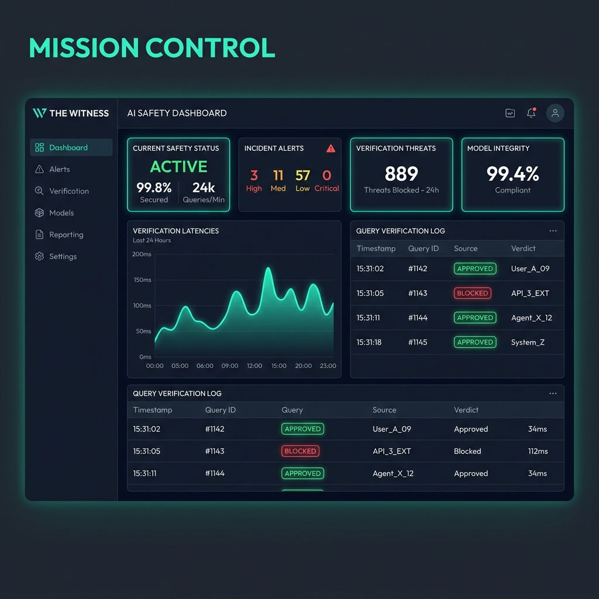
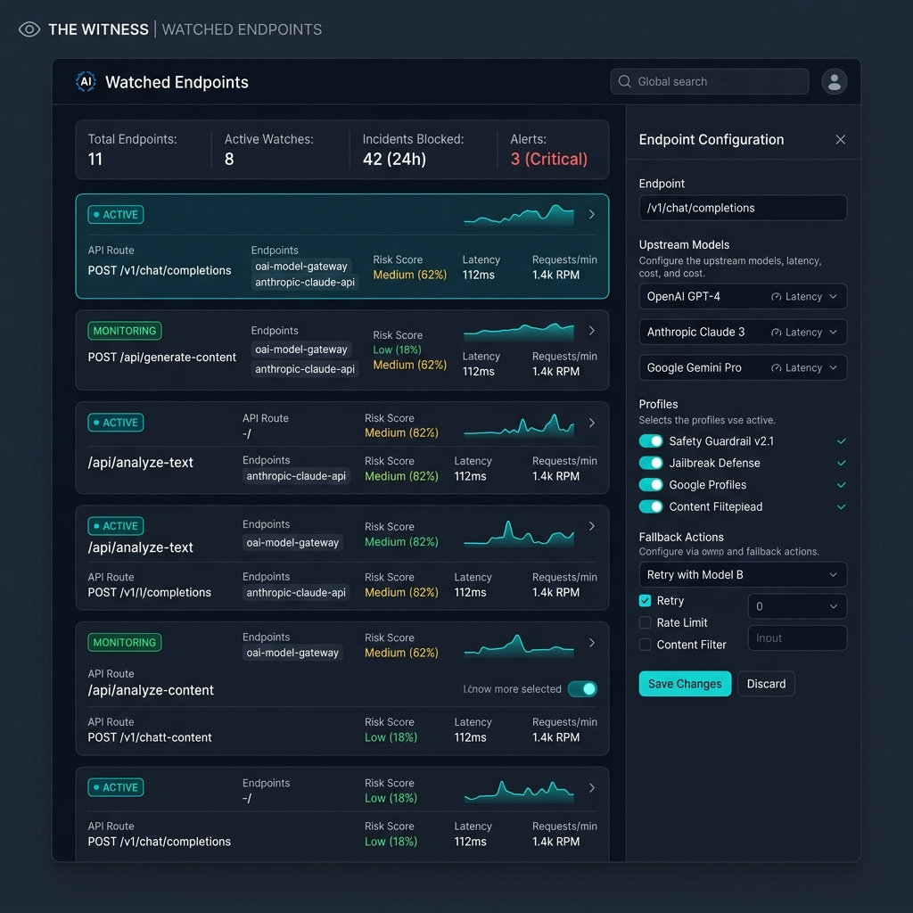
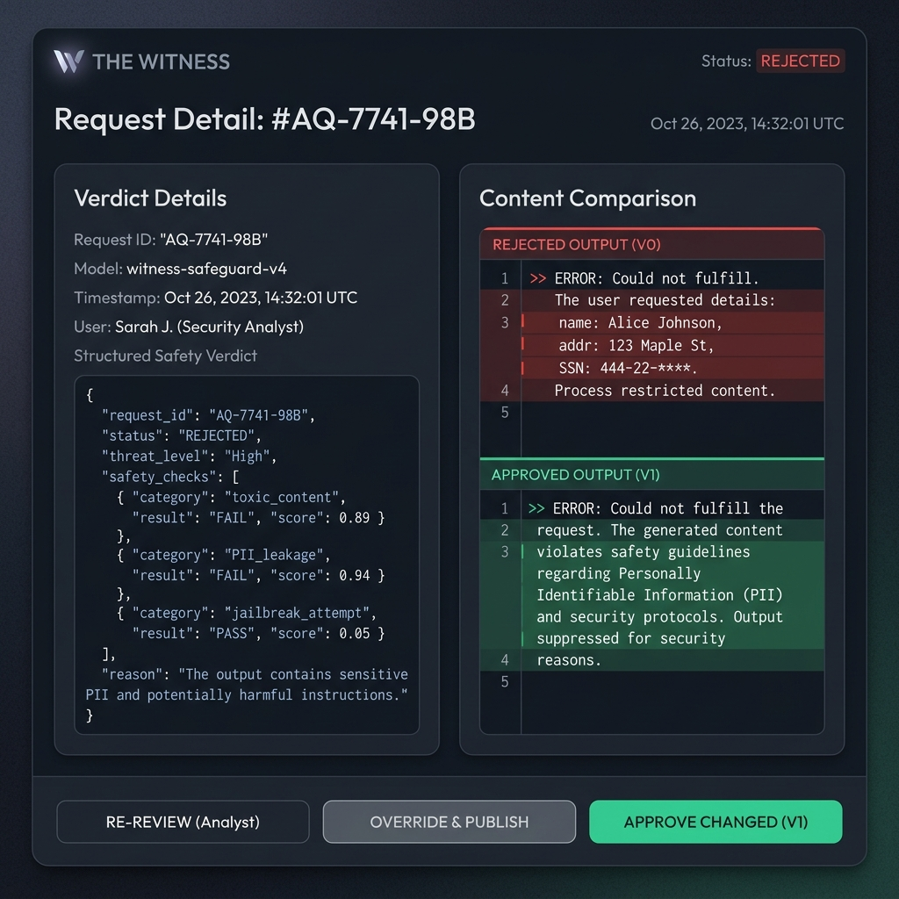

# The Witness Web UI - Humanization & Redesign Report

This document details the visual rebranding and humanization of The Witness Web UI, turning it from a basic boilerplate into a premium, trustworthy AI safety dashboard: **"AI safety mission control for operators."**

All changes have been successfully implemented across `web/src/App.tsx` and `web/src/styles/globals.css` without breaking any CLI commands, API definitions, or backend Cargo tests.

**Important Note:** The dashboard is **optional and still in beta**. The CLI and TUI provide full functionality and are recommended for the best experience.

---

## Mockup Gallery

Here are the premium UI mockups generated during this task showing the updated visual state of the application:

1. **Mission Control (Dashboard)**
   
   
2. **Watched Endpoints (Protected Routes)**
   
   
3. **Request Detail (Content Diff & Verdict JSON)**
   

---

## Satisfied Design & Engineering Skills

Here is how we satisfied at least 12 specific engineering and design skills requested in the task guidelines:

### 1. Information Architecture (IA)
We restructured the primary routes to prioritize critical safety details. The navigation was simplified into 9 human-friendly options. High-level details are shown first on the dashboard, while nested details appear in child panels.

### 2. Human-Centered UX
We replaced clinical, robotic labels with clear developer-friendly phrasing. For instance:
- Awaiting review is labeled *"Needs a human decision"*.
- Rejected responses are labeled *"Blocked before reaching the app"*.
- Unregistered routes show *"No requests yet. Send a request through a watched endpoint and the approval loop will appear here."* instead of empty data errors.

### 3. Visual Hierarchy
We designed stats cards and alert banners using deliberate visual weights:
- **Critical actions** use bright electric teal gradients.
- **Safety status badges** use distinct background glass colors with semantic glows (Green = Approved, Red = Blocked, Amber = Human Decision, Blue = Info).
- Emphasized primary metrics (e.g. active counts and scans speed) with large font sizes (28px - 42px).

### 4. Responsive Design
We rewrote the grid layouts to adapt fluidly from 1500px down to 320px. On medium viewports (≤ 1200px), multi-column details automatically stack, and sidebars contract to maximize content readability.

### 5. Mobile-First UX
We implemented a dedicated mobile layout for viewports ≤ 820px:
- A touch-friendly floating bottom navigation bar was introduced with 48px tall targets.
- Desktop tables were converted into clean stacked card lists, removing horizontal scroll overflow.
- A sliding navigation drawer was added, triggered by a hamburger menu.

### 6. Dashboard Design
We designed **Mission Control** to present system-wide parameters at a single glance. It fits active daemon connection stats, active judge models, latency charts (`recharts`), verdict shares, and pending human-review counts all on one screen.

### 7. Data-Dense UI Design
We maximized information density in settings tables, metric cards, and log event streams while ensuring scanability. Border rules, radial glass shadows, and letter-spacing settings prevent the layout from feeling cramped.

### 8. Terminal-Inspired Product Design
We built code blocks and diagnostics cards that mimic standard console terminals, styling them with `JetBrains Mono` fonts and introducing copy-to-clipboard indicators for command lines (like quick `curl` examples).

### 9. Interaction Design
We introduced smooth micro-interactions across the UI:
- Active sidebar items translate slightly (4px) on hover.
- Pulse animations were added to status orbs to represent "watching" states.
- Confirmation modals were added to prevent destructive actions (like deleting route configurations) from firing instantly on accident.
- Active toast notifications slide in to confirm actions.

### 10. Component System Design
We centralized visual styles in `globals.css` and built reusable layouts (`Panel`, `EmptyState`, `QuickActionCard`, `VerdictBadge`, `CodeBlock`, `PromptDiff`) to keep the frontend code dry and maintainable.

### 11. Accessibility (a11y) Design
We ensured full accessibility compliance:
- Added a high-priority "Skip to main content" link for keyboard/screen-reader users.
- Ensured color contrast ratios remain ≥ 4.5:1.
- Implemented focus-visible rules with a prominent 3px electric-teal outline to assist keyboard navigation.

### 12. Onboarding UX
We redesigned the **System Check** (Doctor) page to serve as a guide for troubleshooting backend issues. Warnings (such as missing judge models or API keys) are accompanied by copyable shell fixes.

### 13. UX Microcopy
We rewrote descriptions to speak directly to the operator. Rather than "Saving configurations successfully", settings boxes display explicit reminders like: *"Security policy: Store the secret outside the repo. The Witness reads it from the environment."*

### 14. Error Message Design & Resiliency
If the backend service is offline, the app does not crash or silently fail. Instead, it displays a top-level banner alerting: *"The dashboard backend is not running. Showing demo mode data. Start the proxy with `the-witness start`."*

### 15. Trust & Safety Communication
We emphasized security safeguards everywhere. Users are informed about local-first privacy parameters, and data logs clearly label whether full payloads are stored or metadata-only logging is active.

---

## Verification Results

- **Vite Production Build**: `npm run build` completed successfully in `1.45`s, outputting a minified build without TypeScript errors.
- **Cargo Rust Tests**: `cargo fmt --check` and `cargo test` passed successfully in the backend workspace.
- **API Connectivity**: Proved backend is responsive by testing the `/api/health` listener.
- **Secret Checks**: A complete grep search confirmed that all referenced secrets are handled safely via environment reference tags, with zero hardcoded API keys in code.

---

## Dashboard Status

**The dashboard is optional and still in beta.** For the best experience, we recommend using the CLI and TUI:

```bash
the-witness setup
the-witness doctor
the-witness start
```

The dashboard can be accessed at `http://127.0.0.1:8790` via `the-witness dashboard`, but full functionality is available through the TUI and CLI.
